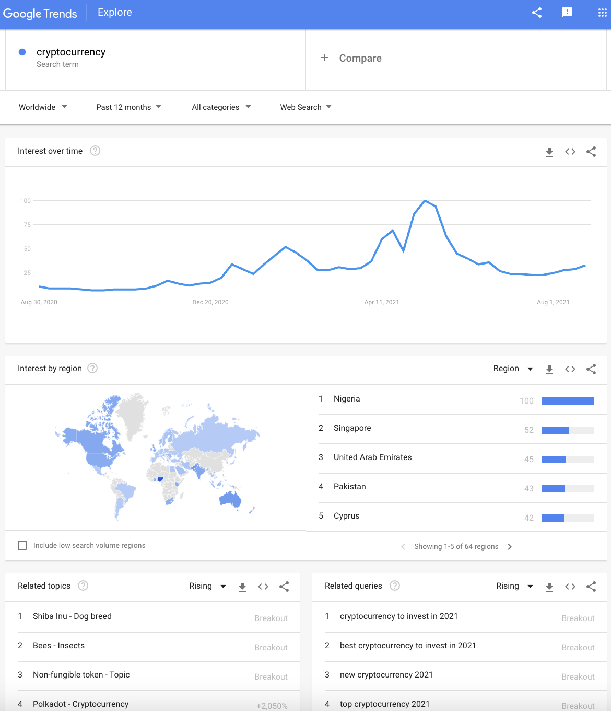

```{r setup, include=FALSE}
knitr::opts_chunk$set(echo = TRUE,
                      message=FALSE,
                      warning=FALSE,
                      fig.height=6,
                      fig.width=9)
options(scipen = 99)
options(digits=3)

library(knitr) ## for functions like include_graphics
library(gtrendsR)
library(tidyverse)
library(scales)
library(gridExtra)
library(here)

theme_set(theme_minimal())
```

[Google Trends](https://trends.google.com/trends/) is a popular tool for all manner of curiousity related to trends in search activity on the Google search engine: 

* what topics are trending? 
* what are trends for a given search term? 
* how does this compare to other terms? 
* what related terms are people using?
* how does interest vary by region? 

And lots more.

Google Trends has recently passed its 15th birthday, prompting a Google blog post on ["15 Tips for Getting the Most Out of Google Trends"](https://blog.google/products/search/15-tips-getting-most-out-google-trends/). One thing they noted right at the start is that they used Google Trends to identify search queries related to Google Trends in order to prioritize content for a blog post. This is a classic use case - **using Google Trends to fuel content decisions for your marketing**.

An important point is that Google Trends does not represent or translate to an *actual* number of searches. This search interest presented is **indexed between 0 and 100**, where **100 indicates the peak search interest during the particular date range** reported on. Everything is *relative* in Google Trends.

## Going Beyond the Interface

```{r, echo=FALSE, fig.width=400, caption='google trends interface'}
## 2 approaches to images:
## 1. can add this text to body of markdown - less flexible output, harder to size
# 

## 2. preferred/recommended: in code (need knitr pkg)
include_graphics(here('figure','google-trends-interface-page-crypto.png'))
```

Google Trends is a convenient, intuitive interface packed with info that can be great for playing around with, but comes with limitations for tracking trends over time, sharing with others, analyzing more deeply. You can **export** to a spreadsheet, but this comes with inefficiencies as well: you have to export data for each component in the interface separately and you may lose source information. And if you want to make any adjustments (change date range, geography, category, add terms) you have to go back in there and repeat the process.

**Using R to work with Google Trends** can provide a more efficient solution if you want to:

* quickly **import** Google Trends data into R for further analysis.
* grab **all the modules** from the Google Trends interface at once (interest over time, geo data, related topics, related queries).
* **repeat** Google Trends reporting to monitor trends over time.
* **reproduce** the same Google Trends data in future, based on detailed record of your query.
* **integrate** Google Trends reporting with other datasets or reporting structures.

## Google Trends in R

Google does not provide an official API for Google Trends but the [**gtrendsR**](https://cran.r-project.org/web/packages/gtrendsR/gtrendsR.pdf) R package created by Philippe Massicotte is a major helper in the accessing Google Trends data within R for reporting and analysis. Along with all the benefits of using R to process and analyze data, the gtrendsR package provides some big advantages over using the Google Trends Interface:

* **Durability**: don't have to go to the interface and fetch the data each time, you have an on-going reference with source info. You have code that can be referred to, re-used, and shared with others.
* **Scalability**: can expand on existing queries, going beyond the limit of 5 that are available in the tool.

## Google Trends Parameters

Google Trends has a number of parameters that can be used to fine-tune your search: date ranges, geo data, categories, Google properties. These are **available via the gtrendsR package**, corresponding to the options in the Google Trend online interface. You just have to know how to tap into them:

* **Dates**:
    + "now 1-H": last hour - by MINUTE
    + "now 4-H": last 4 hrs - by MINUTE
    + "now 1-d": last day - every 8 MINUTES
    + "now 7-d": last 7 days - HOURLY data
    + "today 1-m": last 30 days - DAILY data
    + "today 3-m": last 90 days - DAILY data
    + "today 12-m": last 12 months - WEEKLY data
    + "today+5-y": last 5 yrs (default) - WEEKLY data
    + "all" since beginning of Google Trends 2004
    + "YYYY-MM-DD YYYY-MM-DD": custom start / end date - granularity will depend on time spans above
<br />    
* **Geo**:
   + use gtrendsR::**countries** to see complete list
   + close to 110,000 options, including country / state / city
   + code below shows how to filter for countries
   + **geo=""** for all countries
<br />   
* **Categories**:
    + use gtrendsR::**categories**
    + over 1,400 categories, with ids that are used in the query
    + **category = 0** for all categories
<br />    
* **Google properties**:
    + specify one or more of 'web', 'news', 'images', 'froogle', 'youtube'
    + gprop=c("web", "youtube") as example for web and youtube search

## Setup - Libraries

There's basically no setup required - no credentials, etc. Only need to load the gtrendsR package. *(I've pre-loaded other packages I'm using for general purpose, such as 'tidyverse', etc.)*

```{r libraries}
library(gtrendsR) ## package for accessing Google Trends - all you need to get going!
```

## Single term query

Using the gtrendsR package to get Google Trends for a single search term.

```{r}
## basic search
gt_results <- gtrends(keyword='cryptocurrency',
        geo="",
        time="now 7-d",
        gprop=c("web"),
        category=0)
```

The query returns a bundle of 7 data frames with different info, reflecting what is shown in the Google Trends interface:

```{r}
names(gt_results)
```

(see screenshot of Google Trends interface for comparison)

### Interest over time

The **'interest_over_time'** data frame is the main data object, with relative search volume for the selected search term, country, period, property, and category.

```{r search-interest-over-time}
chart_title <- "Searches for: cryptocurrency"
sub_title <- "Period: past 7 days; Geo: world; Prop: 'web'; Category: all"

## create chart based on search interest over time
gt_results$interest_over_time %>% ggplot(aes(x=date, y=hits, color=keyword))+geom_line()+
  labs(title=chart_title, subtitle=sub_title, x="", y="")
```

### Related Topics

The 'related_topics' data frame holds data on queries related to the main search term ('cryptocurrency' in this case).

```{r}
str(gt_results$related_topics)
```

* **subject**: relative value to main search term
* **related_topics**: contains 'top' topics and 'rising' topics
* **value**: related topic
* **keyword**: main search term
* **category**: search term category, if applicable

```{r related-topics}
  chart_title <- "crytopcurrency: related topics"
  ## 
  top <- gt_results$related_topics %>% filter(related_topics=='top' & !is.na(subject) &
                                                subject!='<1')
  ## convert value to factor and subject to numeric
  top$value <- as.factor(top$value)
  top$subject <- as.numeric(top$subject)
  ## PLOT related topics
  top %>% ggplot(aes(x=reorder(value, subject), y=subject))+geom_col()+
  coord_flip()+
    scale_y_continuous(expand=expansion(add=c(0,10)))+
    labs(title=chart_title, y='', x='')
```

### Related Queries

Related Queries module has similar structure to Related Topics:

```{r}
str(gt_results$related_queries)
```

```{r related-queries}
  chart_title <- "crytopcurrency: related queries"
  ## 
  top <- gt_results$related_queries %>% filter(related_queries=='top' & !is.na(subject) &
                                                subject!='<1')
  ## convert value to factor and subject to numeric
  top$value <- as.factor(top$value)
  top$subject <- as.numeric(top$subject)
  ## PLOT related topics
  top %>% ggplot(aes(x=reorder(value, subject), y=subject))+geom_col()+
  coord_flip()+
    scale_y_continuous(expand=expansion(add=c(0,10)))+
    labs(title=chart_title, y='', x='')
```

You can see right there the possibilities for content marketing: if you're a crypto currency blogger, for example, you may want to write about how to identify the 'best cryptocurrency', etc.

## Multi-Term Query

The same approach used to query for single terms can be extended to multiple terms. The example below shows how to load up a collection of terms, as well as leveraging other variables for the query.

```{r}
## create list of multiple search terms
srch_term <- c("cryptocurrency",
               "bitcoin",
               "ethereum",
               "stock market",
               "real estate")
period <- "today 12-m"
ctry <- "" ## blank = world; based on world countries ISO code
prop <- c("web")
cat <- 0 ## 0 = all categories

## user-friendly versions of parameters for use in chart titles or other query descriptions
ctry_ <- ifelse(ctry=="","world",ctry)
prop_ <- paste0(prop, collapse=", ")
cat_ <- ifelse(cat==0,"all",cat)

## use gtrendsR to call google trends API
gt_results <- gtrends(keyword=srch_term,
        geo=ctry,
        time=period,
        gprop=prop,
        category=cat)
```

The gt_results object returned is the same as with single query, just has more values for the 'keyword' variable in each data frame.

### Interest over time

```{r search-interest-multi-terms}
chart_title <- paste0("Search trends: ", paste(srch_term[1:2], collapse=", "), " +")
sub_title <- paste0("Period: ", period, "; Geo: ", ctry_, "; Prop: ", prop_, "; Category: ", cat_)

## create chart based on search interest over time
gt_results$interest_over_time %>% ggplot(aes(x=date, y=hits, color=keyword))+geom_line()+
  scale_y_continuous(expand=expansion(add=c(0,0)))+
  labs(title=chart_title, subtitle=sub_title, x="", y="")
```

As noted, there is the same limitation as the interface of *maximum five terms* at a time. Of course, one of the beauties of doing thing programmatically is that provides opportunities for combining queries to go beyond five. For that, you need to make sure there is a common term in each queries to calculate the relative values. This is a topic for another blog post.

## Search Terms vs Search 'Topics'

Tip #3 in ["15 Tips for Getting the Most Out of Google Trends"](https://blog.google/products/search/15-tips-getting-most-out-google-trends/) mentions the importance of **choosing search 'topics' when available** for a given search term. 

Using a topic version of the term has benefits, but also complications for programmatic access:

* you need to go to Google Trends to check if a topic is available (it may also be called something different than 'topic', like 'currency' for the term 'Bitcoin').
* the topic term is an indecipherable code, as circled in the URL in the browser bar above.
* comparisons may be skewed if mixing terms and topics.

```{r, echo=FALSE, fig.width=400, caption='google trends search types'}
include_graphics(here('figure','google-trends-search-type-example-full.png'))
```

The best way to handle this situation:

1. If in doubt, go to Google Trends and determine if there is a topic for your term.
2. If you want to use the topic, copy the code from the URL.
3. The term is encoded so you can drop it in a [URL decoder](https://www.url-encode-decode.com/) OR...just **replace the '%2Fm%2F' with '/m/'** and use the rest as is.
3. Use this in your query - it will still work with **gtrendsR**...*BUT*...it **won't mix with search terms** in the same query. :( You can still do multiple topic terms, even if identified as different topics, but you can't mix terms and topics.

So you may have to decide between using the topic version or the basic search term, depending on your needs. As in the example above, both versions *tend* to trend the same, with the topic having higher volume. No guarantees, though.

### Example with topics

```{r, echo=FALSE, fig.width=400, caption='google trends search topics'}
include_graphics(here('figure','google-trends-topic-crypto-bitcoin.png'))
```

```{r}
## create list of multiple search terms using topic codes, separated by commas in URL and decoded
srch_term <- c("/m/0vpj4_b",
               "/m/05p0rrx")

srch_topic <- c("Cryptocurrency_topic",
                "Bitcoin_currency")

period <- "today 12-m"
ctry <- "" ## blank = world; based on world countries ISO code
prop <- c("web")
cat <- 0 ## 0 = all categories

## user-friendly versions of parameters for use in chart titles or other query descriptions
ctry_ <- ifelse(ctry=="","world",ctry)
prop_ <- paste0(prop, collapse=", ")
cat_ <- ifelse(cat==0,"all",cat)

## use gtrendsR to call google trends API
gt_results <- gtrends(keyword=srch_term,
        geo=ctry,
        time=period,
        gprop=prop,
        category=cat)

## replace codes with topics
## - extract interest_over_time data frame
gt_interest <- gt_results$interest_over_time
## - replace codes with corresponding terms
gt_interest <- gt_interest %>% mutate(
  keyword=ifelse(keyword==srch_term[1],srch_topic[1],
                 ifelse(keyword==srch_term[2], srch_topic[2],""))
)
```

```{r google-trends-topics-bar-line, fig.height=3.5, fig.width=10}
## create chart based on search interest over time
pint1 <- gt_interest %>% ggplot(aes(x=date, y=hits, color=keyword))+geom_line(size=2)+
  scale_y_continuous(expand=expansion(add=c(0,0)))+
  scale_color_manual(values=c("red","blue"))+
  theme(legend.position = 'top')+
  labs(x="", y="")

pint2 <- gt_interest %>% group_by(keyword) %>% summarize(avg_int=mean(hits)) %>%
  ggplot(aes(x=keyword, y=avg_int, fill=keyword))+geom_col()+
  scale_y_continuous(limit=c(0,100), expand=expansion(mult=c(0,0.1)))+
  scale_fill_manual(values=c("red","blue"))+
  theme(legend.position = 'none',
        axis.text.x = element_blank())+
  labs(x="Average", y="")

grid.arrange(pint2, pint1, nrow=1, widths=c(2,8))
```

## Wrap-up and Additional References

There's lots more you can do with Google Trends and gtrendsR. I hope to cover some more ideas in future blog posts. In the meantime, hopefully this is a helpful start!

### References

Other useful references for working with gtrendsR and Google Trends:

* [gtrendsR vignette](https://cran.r-project.org/web/packages/gtrendsR/gtrendsR.pdf)
* https://blog.quiet.ly/industry/exploring-google-trends-explore-function-finding-keywords-queries/ 
* https://blog.google/products/search/15-tips-getting-most-out-google-trends/
    + the more authoritative and recent blog post mentioned above
    
Happy trending!

